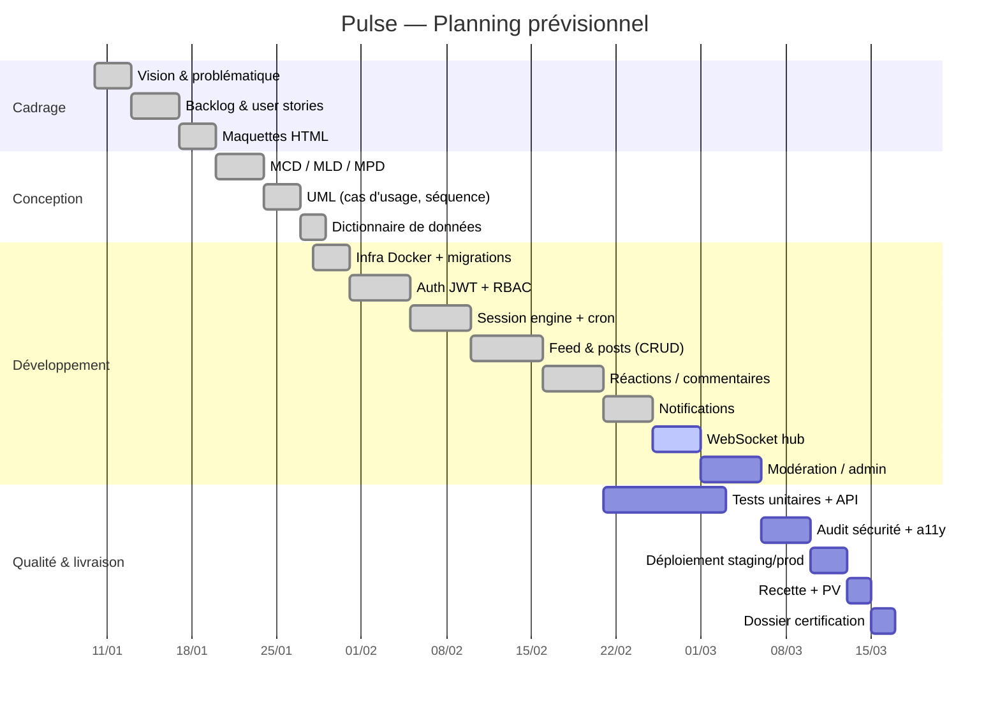

# Pulse — Gestion de projet

## Méthode

Projet solo développé en **Scrum adapté**, avec des sprints hebdomadaires.

| Élément Scrum | Adaptation solo |
|---|---|
| Product Owner | Romain Savary (définit la vision et priorise le backlog) |
| Scrum Master | Romain Savary (garant de la méthode) |
| Développeur | Romain Savary |
| Sprint | 1 semaine |
| Daily | Point quotidien formalisé dans un journal de bord (5 min) |
| Sprint review | Démo aux pairs Zone01 en fin de sprint |
| Rétrospective | Notes écrites en fin de sprint (cf. `bilan-retrospective.md`) |

## Outils

- **Gestion de backlog** : GitHub Projects + GitHub Issues (labels `sprint-1`, `sprint-2`, `sprint-3`)
- **Suivi de code** : branches `feat/*`, `fix/*`, `chore/*` — PRs systématiques même en solo pour garder l'historique lisible
- **Documentation vivante** : `CLAUDE.md` à la racine (contexte projet), `pulse-certif/` pour la documentation de certification
- **CI/CD** : GitHub Actions (cf. `../05-deploiement/plan-deploiement.md`)

## Jalons

| Jalon | Contenu | Statut |
|---|---|---|
| J0 — Cadrage | Vision, problématique, backlog initial, maquettes | ✅ |
| J1 — Squelette | Docker Compose, migrations DB, `/health` | ✅ |
| J2 — Auth | Register/login JWT httpOnly, middleware RBAC | ✅ |
| J3 — Session engine | Cron session, `/api/session/current`, règle 1 post / session | ✅ |
| J4 — Feed & posts | CRUD posts, feed chronologique, intentions | ✅ |
| J5 — Interactions | Réactions, commentaires, follows, notifications | ✅ |
| J6 — WebSocket | Hub temps réel, broadcast `new_post` / `session_closed` | 🟡 |
| J7 — Modération | Reports, dashboard admin/moderator | 🟡 |
| J8 — Déploiement | Nginx + SSL, staging, production | 🟡 |
| J9 — Recette & rendu | Tests E2E, PV recette, dossier certification | 🟡 |

> À mettre à jour en fin de projet avec les dates réelles.

## Planning Gantt

> Les dates ci-dessus sont indicatives. Remplacer par les dates réelles avant le rendu jury.

## Rituels

- **Daily (5 min)** : journal de bord écrit dans `notes/journal.md` — ce qui a été fait la veille, objectif du jour, blocage éventuel.
- **Sprint review** : démo aux pairs Zone01 en fin de semaine (vendredi).
- **Rétrospective** : 15 min en fin de sprint — "Keep / Stop / Start", consignée dans `bilan-retrospective.md`.

## Gestion des risques

| Risque | Probabilité | Impact | Parade |
|---|---|---|---|
| Dérapage périmètre | Haute | Moyen | MoSCoW strict, modération priorité basse |
| Bug critique fenêtre session | Faible | Haut | Tests d'intégration sur le cron + feature flag |
| Retard sur la CI/CD | Moyenne | Moyen | Mise en place CI dès J1 |
| Complexité WebSocket | Moyenne | Moyen | Fallback polling documenté |

## Références

- Backlog détaillé : `../01-cadrage/backlog.md`
- Epics & user stories : `../01-cadrage/epics-user-stories.md`
- Plan de déploiement : `../05-deploiement/plan-deploiement.md`
